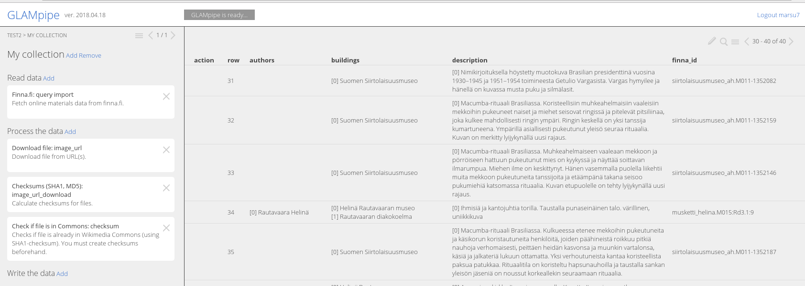

**GLAMpipe** is an extensible open source web-app for transforming datasets and uploading data and media to online repositories.

 ####GLAMpipe can be used to:
- browse metadata
- importing metadata + files
- process metadata + files
- exporting metadata + files

####GLAMpipe can import from:
- csv files (local/online)
- [DSpace 6](http://www.dspace.org/)
- [Internet Archive](https://archive.org/)
- [Wikidata](http://wikidata.org)
- [Map warper](https://github.com/timwaters/mapwarper)
- [Finna](http://finna.fi)
- [Plone](https://plone.org/) (initial version)
- [ePrints](http://www.eprints.org/) (very initial version)

####GLAMpipe can export to:
- csv
- [DSpace 6](http://www.dspace.org/)
- [Plone](https://plone.org/) (initial version)
- [Omeka S](https://omeka.org)
- [Wikimedia Commons](https://commons.wikimedia.org)

####GLAMpipe is a wrapper for other open-source programs:
- [pdftotext](https://www.npmjs.com/package/pdf-to-text)
- [CLD2](https://github.com/dachev/node-cld) (Compact Language Detector)
- [GROBID](https://grobid.readthedocs.io/en/latest/) (requires separate install)

 The basic idea of GLAMpipe is to read data and files from different sources, process the metadata and export the data and files to different destinations. The workflow is based on **documents and nodes** instead of rows and cells.

 A building block of the data flow is called a node. Each node can do one thing. For example, a node can import data from a source. Another node can modify the data in different ways: split text, combine strings, format Wikimedia templates etc. Finally, a node can export data as files or as data in different formats and to different services like Wikimedia Commons or Wikidata.

  If you want to start experimenting directly, go to the [demo](http://demo.glampipe.org). If you plan to work more extensively with the tool, check out [installation pages](../installation).
