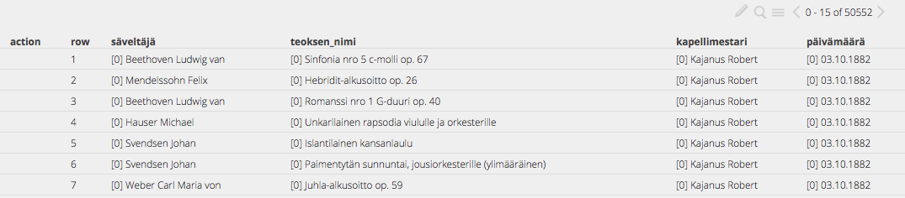
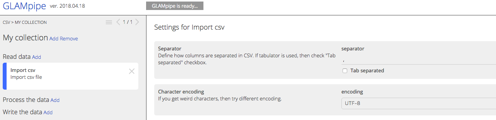

Importing data to GLAMpipe happens via import nodes. Currently there are import nodes for CSV files, DSpace, Wikidata, Flickr and Finnish national service FINNA.

#### Task 1:
- import a information about scientific articles from CSV file

##### Background information

Here is a sample [CSV file](https://drive.google.com/file/d/19JQoH1YIHaqSYU07FFTPekhByaJZUMKs/view?usp=sharing) | 
[direct download link](https://drive.google.com/uc?export=download&id=19JQoH1YIHaqSYU07FFTPekhByaJZUMKs&noprocess).
The file contains information about articles green access articles of University of Jyväskylä. The separator is comma and endocing is UTF-8.

##### Solution
 1. Download the file.
 2. Create a new project.
 3. Choose Read Data > Import from file > Import CSV
 4. Choose the downloaded CSV file and click "Create Node"
 5. Click the node created and open its settings from the top of the main window.
 4. Give separator, encoding and click "Import Data" 

##### Task 2
- import some collection from demo.dspace.org

##### Task 3 
- import information about buildings designed by Alvar Aalto from Wikidata.