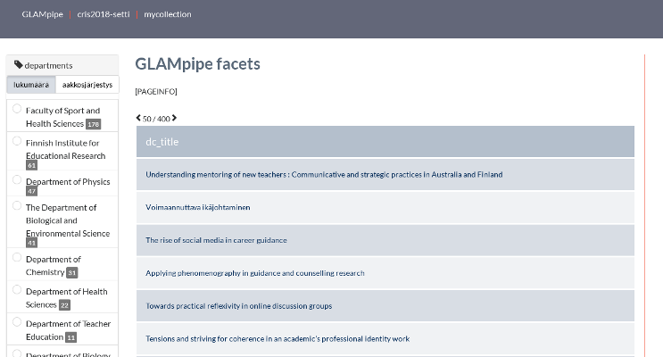
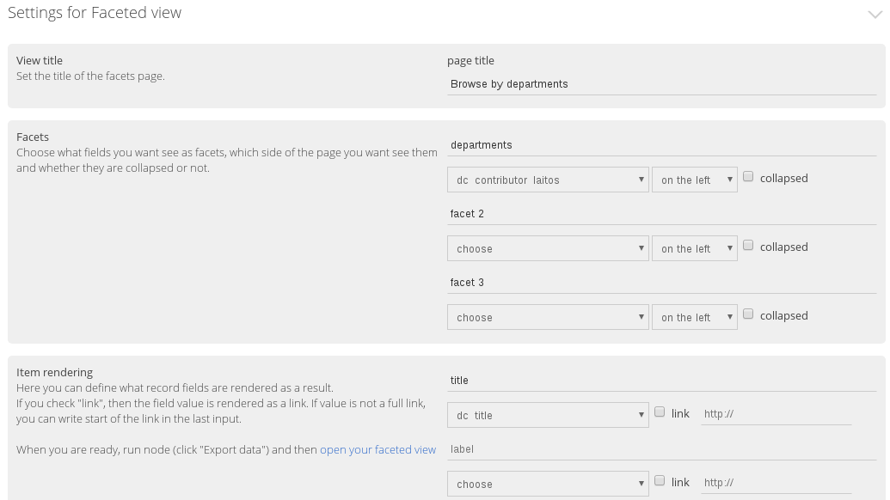
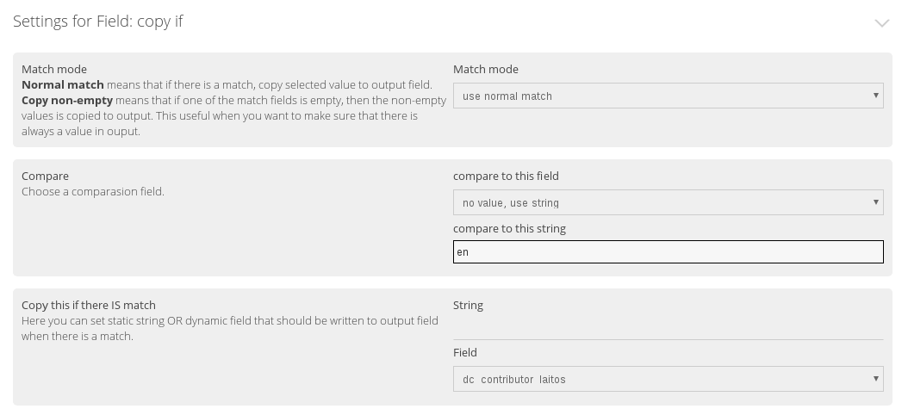
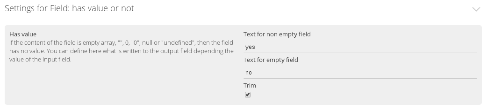

In this tutorial you'll learn how to make data imported to GLAMpipe easily browseable with **faceted view node**. We create a application, where use can browse articles by department and by article's embargo status (whether article is under embargo or not).

#### Task 1:
Continue from CSV-import from previous tutorial or import cris2018-data-sample.csv again.

- make a faceted view where user can browse articles **by department**

##### Background information:
Department information is in the field "dc.contributor.laitos". Departments are always in two languages: finnish and english. This means that you get duplicate values in your facet view. Let's ignore this so far.

##### Solution:
GLAMpipe has a specific export node called **faceted view**. WIth facet view you can choose what fields are displayed as facets and what fields are displayed as result.
1. You can find it from **Write the Data > Export data to view -> Faceted view**. 
2. Create the facet node. The node has no parameters, so you can just click "Create Node".
3. In the Facets section, choose **dc_contributor_laitos** as a facet 1 field. Rename the label of the field to "departments".
4. In the Item rendering settings, choose "dc.title" from the first dropdown. Change the "label" to "title".
5. Click **Export data**. This creates a webapplication, that uses the data vie GLAMpipe's rest api.
6. Click "Open your faceted view" from Item rendering settings.

#### Task 2:
- Remove language version from faceted view, so that the view use only english names of departments.

##### Background information:
The language information for a specific field is in field called field name + '\_\_lang'. So, language information of the department is in the field **dc_contributor_laitos__lang**. 

##### Solution
The solution is to copy only english department names to a new field and use that field in faceted view. Copying can be done with "copy if" node, which copies a value from certain field if certain criteria is met.

1. Click Process the data > Modify data > copy if.
2. Choose **dc_contributor_laitos__lang** as an input field in node parameters and click Create node.
3. In the "Compare" section, write **"en"** to the "compare to this string" input.
4. Then in the "Copy this if there IS match" section choose **dc_contributor_laitos** from Field input.
5. Try with one document by clicking "Try this".
6. If that worked, then click **"Batch run"**. Now you have a new field with english names of departments.
7. Change that field to your facet view and click "Export data".

#### Task 3:
- Make a faceted view where user can browse all articles that are under embargo(*) by department and year.

##### Background information
*) Embargo is a open access restriction set by the publisher. It means that article can be made freely available only after that date.

There is an embargo field (dc.date.embargo) where the information about embargo is. You can assume that if dc.date.embargo field holds data, then article is under embargo. So you do not have to check the dates.

##### Solution:
In order to make this set browseable by embargo, we need to convert embargo to boolen type of value. We can use a node called "Has value or not".The node can be find from Process -> modify data.

1. Choose **Process Data** -> **modify data** -> **Has value or not**
2. Choose "dc_date_embargo" as an input field from Field input.
3. Rename output field as "has_embargo" and click "Create node". 
4. Click **"Batch run"**. 
5. Click "faceted view" node and add "has_embargo" as a second facet.
4. Click "Export data" so that facet view gets updated.

