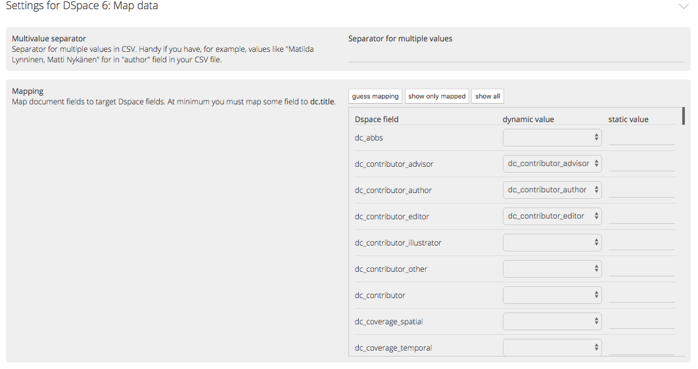
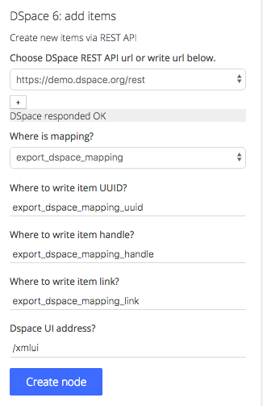

GLAMpipe can export data to web services via export nodes.

#### Task 1
- map your data to a DSpace 6 demo instance.

##### Background information
The process of uploading data has two steps. First the original data must me mapped to the schema of target DSpace. Next, the mapped data is uploaded to DSpace.

##### Solution
The mapping is done with DSpace mapping node. You can find it from **Process data > Map data > DSpace 6: map data**. You need to choose the target DSpace.  

#### Task 2
- upload the mapped data to DSpace

###### Background information
Export to DSpace is done via **DSpace 6: add item** that can be find from **Export data > export to web**.

##### Solutions
When you create the export node, you need to give the mapped data field as input. 

Then, in the settings you pass your user credentials. It is a good idea to try first with single document first and check the result before making batch run.