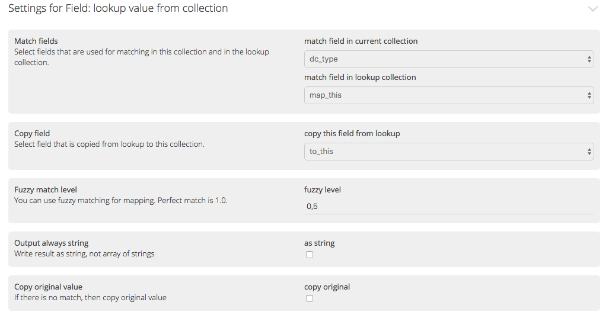

Lookups can be used to fetch some additional data based on values in original data.

#### Task 
- map one field to an different value. 

##### Background information
There is a tiny csv file that maps "article" to "This was 'article'. You can find it [here](https://drive.google.com/file/d/1TaLTRzPSm3t7IH2aEJslnJpYnzcDrEGG/view?usp=sharing).

The actual lookup is done with collection lookup node: **Process data > Lookup data > Field: Look up value from collection**

##### Solution
You need to add a new collection to your project and import lookup data there. Then, in the original collection, add a the collection lookup node.

#### Task
- make a automatic subject indexing by using ANNIF-service. 

##### Background information
Annif is a service for automatic subject indexing for text written in english, finnish and swedish.